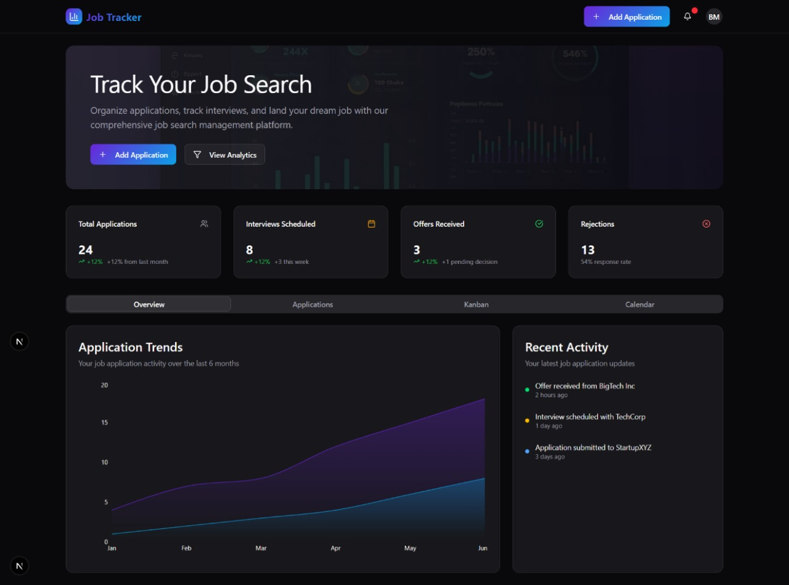
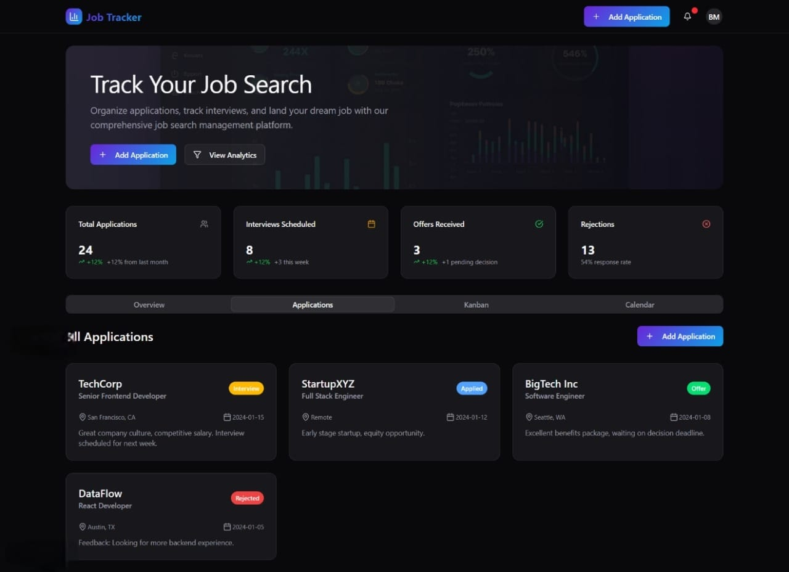
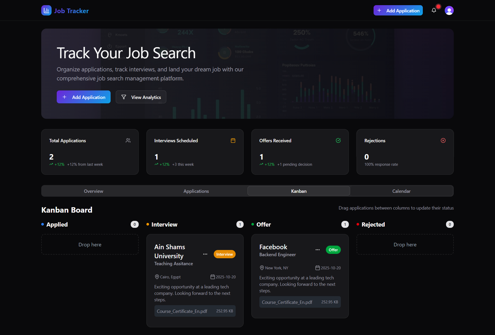
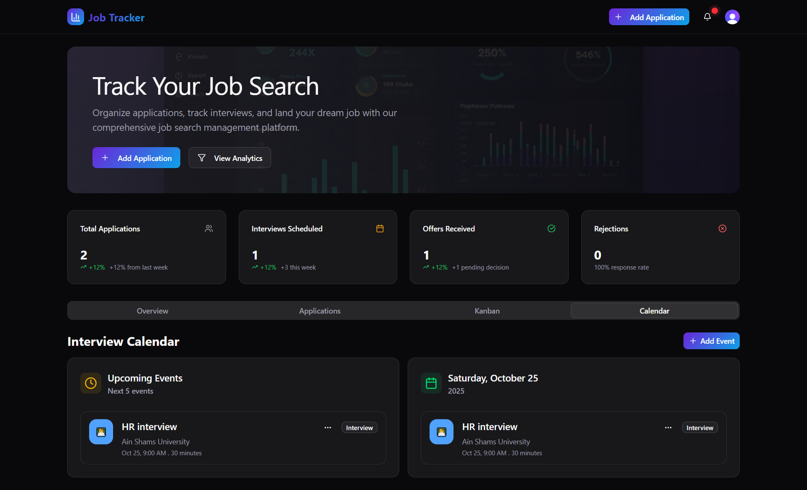
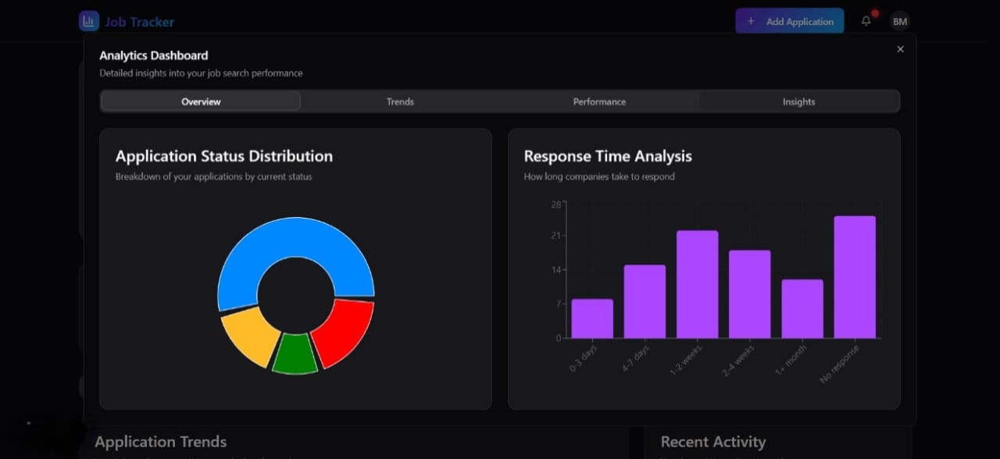
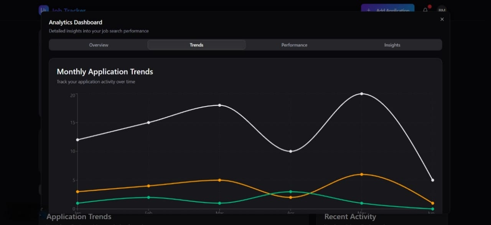
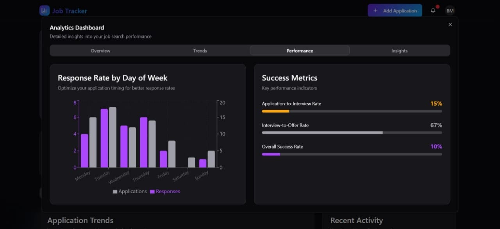

# 💼 Job Tracker

Personal job application management dashboard.



---

<!-- ## 🚀 Live Demo

🔗 **Live URL:** [https://project-demo.vercel.app](https://project-demo.vercel.app)

--- -->

## 🧠 Overview

This is a full‑stack Job Tracker web app (Next.js + TypeScript) for managing job applications, interviews, events and activities with a responsive Tailwind/shadcn UI.

It was built to centralize and streamline job‑search workflows (applications, interview scheduling, notes, attachments) and provide actionable analytics to improve follow‑up and response time.

<!-- _Example:_
This is a full-stack e-commerce web app built with Next.js and Express.js.
It allows users to browse products, add items to their cart, and make payments securely using Stripe. -->

## 💡 Problem

Finding a job today involves applying to dozens (sometimes hundreds) of positions across multiple platforms like LinkedIn, Indeed, and company websites.  
Most job seekers struggle to **keep track of their applications** — which companies they’ve applied to, what stage they’re in, and whether they need to follow up.

This leads to:

- Missed follow-ups or interviews
- Duplicate applications
- Confusion about deadlines and communication
- Extra stress during the job search process

---

## ✅ Solution

The **Job Tracker App** provides a simple, centralized dashboard to manage and monitor all job applications in one place.

With this app, users can:

- Add, edit, and delete job applications
- Track each job’s status (Applied, Interview, Offer, Rejected, etc.)
- Store key details like company name, role, date applied, and contact info
- Visualize progress with charts or summaries
- Stay organized and focused throughout their job search

---

## 🧩 Features

- ✅ Authentication (Clerk) with role-based access (Admin, User)
- ✅ Add, edit, and delete job applications (CRUD)
- ✅ Application status workflow (Applied → Interview → Offer → Rejected)
- ✅ Interview scheduling with date/time, notes, and reminders
- ✅ Attachments & resume uploads (Cloudinary) and persistent notes per application
  <!-- - ✅ Search, filtering, and sorting (company, role, status, date applied, tags)   -->
  <!-- - ✅ Bulk import/export (CSV) for applications and contacts   -->
- ✅ Analytics dashboard (application counts, conversion rates, timelines)
- ✅ Responsive, mobile-first UI built with TailwindCSS and shadcn/ui
- ✅ REST API built with Express.js and MongoDB (Mongoose)
- ✅ Deployed frontend to Vercel; backend-ready for Node.js hosting

---

## 🧰 Tech Stack

**Frontend:** React, Next.js, TailwindCSS  
**Backend:** Node.js, Express.js, MongoDB (Mongoose)  
**Deployment:** Vercel (Frontend)  
**Other Tools:** Cloudinary, Clerk, Axios

---

## 📸 Screenshots

<!-- | Overview                                | Applications                                    | Kanban                              | Calendar                                | Analytics Overview                                          | Trends                              | Performance                                   |
| --------------------------------------- | ----------------------------------------------- | ----------------------------------- | --------------------------------------- | ----------------------------------------------------------- | ----------------------------------- | --------------------------------------------- |
|  |  |  |  |  |  |  |
-->

### 🏠 Overview


### 📋 Applications


### 🗂️ Kanban Board


### 📅 Calendar View


### 📊 Analytics Overview


### 📈 Trends


### ⚙️ Performance


---

## ⚙️ Installation & Setup

1️⃣ Clone the repo

```bash
git clone https://github.com/BasharMOhamed/Job-Traker.git
cd Job-Traker
```

2️⃣ Install dependencies

```bash
npm install
```

3️⃣ Create a `.env` file with your credentials

```bash
MONGODB_URI=your_mongo_url
NEXT_PUBLIC_CLERK_SIGN_IN_URL=/sign-in
NEXT_PUBLIC_CLERK_SIGN_IN_FALLBACK_REDIRECT_URL=/
NEXT_PUBLIC_CLERK_SIGN_UP_FALLBACK_REDIRECT_URL=/
NEXT_PUBLIC_CLERK_SIGN_UP_URL=/sign-up
NEXT_PUBLIC_CLERK_PUBLISHABLE_KEY=your_clerk_Publishable_key
CLERK_SECRET_KEY=your_Clerk_Secret_Key
CLOUDINARY_CLOUD_NAME=your_cloudinary_cloud_name
CLOUDINARY_API_KEY=your_cloudinary_api_key
CLOUDINARY_API_SECRET=your_cloudinary_api_secret
```

4️⃣ Run the project

```bash
npm run dev
```

---

## 🧪 Testing

To run unit tests:

```bash
npm test
```

---

## 🧑‍💻 Author

👤 **Bashar Mohamed**

- GitHub: [@BasharMOhamed](https://github.com/BasharMOhamed)
- Portfolio: [real-portfolio-ewmp.vercel.app](https://real-portfolio-ewmp.vercel.app)
- LinkedIn: [linkedin.com/in/basharmohamed](https://www.linkedin.com/in/basharmohamed/)

---

## 📜 License

This project is licensed under the **MIT License** — free to use and modify.
